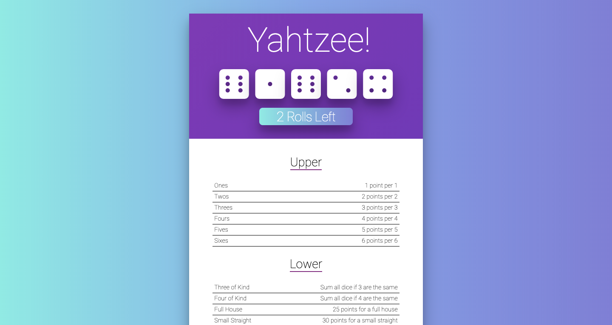
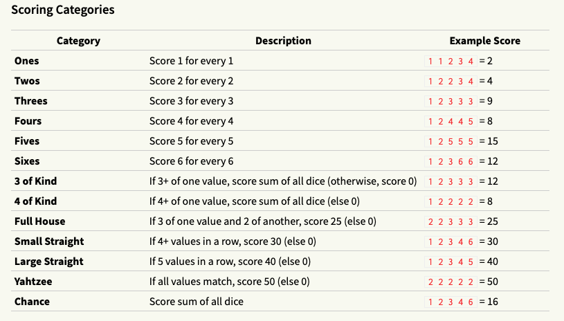

# Yahtzee

[Yahtzee](https://yahtzeeofficial.netlify.com/) is a chance-and-strategy dice rolling game. A game is played over 13 rounds.



## Table of content

- [Description](#description)
- [Installation](#installation)
- [Contact](#contact)

## Description

Yahtzee is a chance-and-strategy dice rolling game. A game is played over 13 rounds.

Each round, the player rolls five 6-sided dice. They may click on any number of dice to “freeze” or “unfreeze” them (frozen dice are displayed in a different color). They may re-roll the unfrozen dice up to 2 times.

Each round, they must assign their dice to any unclaimed scoring category. Each category scores differently.

After 13 rounds, the game is over, and the player’s score is the total of each scoring category.

Game rules are as follows:



## Installation

1. Clone the project to your local directory

```
git clone https://github.com/KaushikShivam/yahtzee
```

2. The project uses NPM for managing dependencies. Run npm install to install all the required dependencies

```
npm install
```

3. Run the task runner to run the app

```
npm run start
```

## Contact

You can contact me at:

- [Portfolio](https://www.shivamkaushik.com)
- [Email](mailto:shivamkaushikofficial@gmail.com)
- [Linkedin](https://www.linkedin.com/in/kshivamdev/)
- [Twitter](https://twitter.com/kShivamDev)
- [Medium](https://medium.com/@shivamkaushikofficial)
- [Angellist](https://angel.co/kshivamdev)
